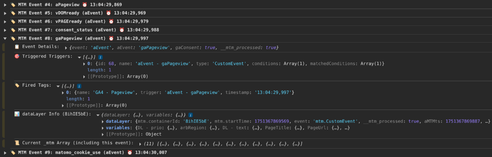

# Matomo Tag Manager Event Monitor

A Chrome extension for debugging and monitoring Matomo Tag Manager (MTM) events, triggers, and tags in real-time.

**Chrome Extension** | **Version 1.3** | **Apache 2.0 License**

## What is it for? - General Information
The MTM Event Monitor helps you debug and analyze your Matomo Tag Manager implementation by providing real-time insights into event firing, trigger conditions, and tag execution.

### In short
The "MTM Event Monitor" provides a comprehensive debugging interface for Matomo Tag Manager implementations. It shows you exactly which events are fired, which triggers are activated, and which tags are executed - all with precise timing information and detailed analysis.

### Something more detailed
Debugging Matomo Tag Manager can often be challenging and time-consuming, especially when trying to understand why certain triggers don't fire or tags aren't executed as expected.

This browser extension solves these problems by providing real-time monitoring of all MTM activities directly in your browser. It captures `_mtm.push()` calls, analyzes trigger conditions, tracks tag execution, and provides detailed variable information - all without requiring any changes to your MTM setup.

The extension integrates with MTM's native debugging capabilities and uses MTM's built-in methods to provide accurate, up-to-date information about your tag management implementation. Whether you're setting up new triggers, debugging existing tags, or optimizing your MTM configuration, this tool provides the insights you need.

### Key benefits
- **Real-time monitoring**: See events as they happen with precise timestamps
- **Trigger analysis**: Understand exactly why triggers fire or don't fire
- **Tag tracking**: Monitor which tags are executed and when
- **Variable inspection**: View current values of all MTM variables
- **Console integration**: Structured logging for detailed debugging
- **No setup required**: Works with any existing MTM implementation

### Even more information
This extension is open source and welcomes contributions from the community. Whether you're a Matomo user, developer, or digital analyst, your feedback and suggestions help improve the tool for everyone.

**License:** Apache 2.0
**Repository:** [GitHub MTM Event Monitor Repository](https://github.com/Andiministrator/MTMmonitor)

---

## 📑 Table of Contents

- [Features](#-features)
- [Screenshots](#-screenshots)
- [Installation](#-installation)
- [Usage](#-usage)
- [Configuration Options](#️-configuration-options)
- [Advanced Features](#-advanced-features)
- [Development](#️-development)
- [Troubleshooting](#-troubleshooting)
- [Contributing](#-contributing)
- [License](#-license)
- [Acknowledgments](#-acknowledgments)
- [Support](#-support)
- [Author and Contact](#-author-and-contact)
- [Changelog](#-changelog)

## 🚀 Features

### 📊 Real-time Event Monitoring
- **MTM Array Monitoring**: Tracks `window._mtm.push()` calls and existing entries
- **DataLayer Integration**: Monitors dataLayer pushes for MTM events
- **Live Event Stream**: See events as they happen with timestamps and detailed information

### 🎯 Advanced Trigger & Tag Analysis
- **Trigger Detection**: Automatically identifies which triggers fire for each event
- **Tag Tracking**: Shows which tags are executed with timing information
- **Condition Analysis**: Displays trigger conditions and their match status
- **Native MTM Integration**: Uses MTM's built-in methods for accurate analysis

### 🔧 Smart Variable Resolution
- **Current Values**: Shows real-time variable values using MTM's native `.get()` method
- **Multiple Types**: Supports DataLayer, Constant, PageUrl, PageTitle, Referrer, and CustomJS variables
- **Context Awareness**: Variables reflect the current event context
- **Filtered Display**: Hides Matomo configuration variables for cleaner output

### 📱 User-Friendly Interface
- **Overlay Display**: Non-intrusive overlay with event details
- **Console Logging**: Optional structured console output for debugging
- **Keyboard Shortcuts**: Quick access with `Ctrl+Alt+M`
- **Event Numbering**: Events numbered to match `_mtm` array indices
- **Virtualization**: Handles large numbers of events efficiently

### ⚙️ Flexible Configuration
- **Selective Monitoring**: Enable/disable MTM array or dataLayer monitoring
- **Auto-show Events**: Automatically display overlay when events are detected
- **Console Logging**: Toggle structured console output
- **MTM Debug Frame Control**: Hide/show MTM's debug iframe

## 📷 Screenshots

### Event Monitoring Overlay

*The main overlay showing detected events with trigger and tag information*

### Configuration Panel

*Easy-to-use configuration panel for customizing monitoring options*

### Console Output

*Structured console output with detailed event information and timing*

## 📦 Installation

### From Chrome Web Store
1. Visit the [Chrome Web Store page](#) (coming soon)
2. Click "Add to Chrome"
3. Confirm the installation

### Manual Installation (Development)
1. Download or clone this repository
2. Open Chrome and navigate to `chrome://extensions/`
3. Enable "Developer mode" in the top right
4. Click "Load unpacked" and select the extension folder
5. The extension will appear in your extensions list

## 🎯 Usage

### Basic Usage
1. **Navigate** to a page with Matomo Tag Manager
2. **Trigger events** by interacting with the page (clicks, form submissions, etc.)
3. **View events** in the overlay that appears automatically
4. **Use shortcuts**:
   - `Ctrl+Alt+M`: Toggle event overlay
   - `Ctrl+Alt+T`: Scroll to top of events
   - `Ctrl+Alt+B`: Scroll to bottom of events

### Event Information Display
Each detected event shows:
- **Event Name**: The name of the fired event (e.g., "timer", "pageview")
- **Timestamp**: Precise timing with milliseconds
- **Event Number**: Numbered to match `_mtm` array indices
- **Source**: Whether from `_mtm.push()` or `dataLayer`
- **Triggered Triggers**: List of triggers that matched the event
- **Fired Tags**: Tags executed with trigger and timing information
- **Event Details**: Complete event data in JSON format
- **Variables**: Current values of all MTM variables
- **DataLayer State**: Current dataLayer content

### Console Debugging
Enable console logging to see structured output:

```
🏷️ MTM Event #0: timer (aEvent) ⏰ 14:23:17.456
  📋 Event Details: {...}
  🎯 Triggered Triggers: [...]
  🏷️ Fired Tags: [
    {
      name: "Google Analytics",
      trigger: "Timer 30s",
      timestamp: "14:23:17.456"
    }
  ]
  📊 dataLayer Info (GTM-ABC123): {...}
  📜 Current _mtm Array: [...]
```

Filter console output with: **🏷️ MTM Event**

## ⚙️ Configuration Options

Access the configuration panel by clicking the **⚙️** button in the overlay.

### Monitoring Options
- **Monitor _mtm Array** *(enabled by default)*
  - Tracks `window._mtm.push()` calls and existing array entries
  - Essential for basic MTM event monitoring

- **Monitor dataLayer** *(disabled by default)*
  - Monitors `dataLayer.push()` calls for MTM-related events
  - May include timer events and other dataLayer activities
  - Enable if you use dataLayer alongside MTM

### Display Options
- **Auto-show events popup** *(enabled by default)*
  - Automatically opens the overlay when events are detected
  - Disable for manual control using `Ctrl+Alt+M`

- **Console logging** *(enabled by default)*
  - Outputs structured event information to browser console
  - Useful for detailed debugging and analysis
  - Can be filtered using "🏷️ MTM Event" in console

### Advanced Options
- **Hide MTM Debug Frame** *(disabled by default)*
  - Hides MTM's built-in debug iframe by setting its height to 0
  - Useful when MTM debug frame interferes with page layout
  - Can be toggled manually using the 🖼️ button in the overlay

**Note**: After changing configuration, click "Save Configuration & Reload Page" to apply changes.

## 🔧 Advanced Features

### MTM Debug Mode Integration
For full trigger and tag analysis, enable MTM Debug Mode:
```javascript
window.MatomoTagManager.enableDebugMode()
```

Without debug mode, the extension will show a warning: "⚠️ MTM Debug Mode not (yet) active"

### Event Format Support
The extension supports multiple MTM event formats:
- **Array format**: `_mtm.push(['aEvent', 'eventName', {...}])`
- **Object format**: `_mtm.push({event: 'eventName', ...})`
- **DataLayer format**: `dataLayer.push({event: 'mtm.customEvent', ...})`

### Variable Types Supported
- **DataLayer**: Variables that read from dataLayer values
- **Constant**: Static values defined in MTM
- **PageUrl**: Current page URL (`window.location.href`)
- **PageTitle**: Document title (`document.title`)
- **Referrer**: Document referrer (`document.referrer`)
- **CustomJsFunction**: Custom JavaScript functions executed in page context

### Performance Features
- **Event Virtualization**: Shows only the 50 most recent events when over 100 events are detected
- **Duplicate Detection**: Prevents duplicate events from cluttering the display
- **Memory Management**: Automatically limits stored events to prevent memory issues

## 🛠️ Development

### Project Structure
```
matomo-tag-manager-monitor/
├── manifest.json              # Extension manifest (v3)
├── content-script.js          # Main content script & UI management
├── injected-script.js         # Page context monitoring script
├── config-script.js           # Configuration bridge script
├── service-worker.js          # Background service worker
├── overlay.html               # Main UI template
├── config-panel.html          # Configuration panel template
├── overlay.css                # Complete styling
├── README.md                  # This README file
└── assets/                    # Extension icons (16, 48, 128px) and Screenshots
```

### Key Components
- **Content Script**: Manages UI overlay, event collection, and user interactions
- **Injected Script**: Monitors MTM in page context using native methods
- **Service Worker**: Handles extension lifecycle, badge updates, and icon clicks
- **UI Components**: Responsive overlay with draggable interface and configuration panel

### Building
No build process required - this is a vanilla JavaScript extension compatible with Manifest V3.

## 🔍 Troubleshooting

### Common Issues

**Events not appearing?**
- Ensure MTM is loaded on the page (`window.MatomoTagManager` exists)
- Check that events are actually being fired (`_mtm.push()` calls)
- Verify MTM array monitoring is enabled in configuration
- Look for console errors that might indicate script conflicts

**No trigger/tag information?**
- Enable MTM Debug Mode: `window.MatomoTagManager.enableDebugMode()`
- Ensure you're using a recent version of Matomo Tag Manager
- Check that triggers are properly configured in your MTM container

**Variables showing wrong values?**
- The extension uses a 50ms delay to ensure MTM processes events first
- Variables reflect the state after MTM event processing
- Verify variable names and dataLayer keys are correct

**"MTM Debug Mode not (yet) active" warning?**
- This is normal for early events before debug mode is enabled
- Later events will show full trigger/tag analysis once debug mode activates
- You can manually enable debug mode in console

**Console filter not working?**
- Use the exact filter: `🏷️ MTM Event`
- Ensure console logging is enabled in the extension configuration
- Check that the browser console is not filtering out logs

### Debug Information
The extension provides extensive debug logging when enabled. Check the browser console for messages prefixed with "MTMevents:" for detailed troubleshooting information.

## 🤝 Contributing

We welcome contributions! Please feel free to submit a Pull Request.

### Development Setup
1. Clone the repository
2. Load the extension in Chrome Developer mode
3. Make changes and test on a page with MTM
4. Submit a pull request with a clear description

### Issues
Found a bug or have a feature request? Please open an issue on GitHub with:
- Steps to reproduce the problem
- Expected vs actual behavior
- Browser version and extension version
- Console errors (if any)

## 📄 License

This project is licensed under the MIT License - see the [LICENSE](LICENSE) file for details.

## 🙏 Acknowledgments

- Built for the Matomo Tag Manager ecosystem
- Inspired by Google Tag Manager debugging tools
- Thanks to the Matomo community for feedback and testing

## 📞 Support

- **GitHub Issues**: [Report bugs or request features](https://github.com/Andiministrator/MTMmonitor/issues)
- **Documentation**: Check this README and inline help in the extension
- **Community**: Share your experience with the Matomo community

---

## Author and Contact

Feel free to contact me if you found problems or improvements:

**Andi Petzoldt**
☛ https://andiministrator.de
✉ andi@petzoldt.net
🧳 https://www.linkedin.com/in/andiministrator/
🐘 https://mastodon.social/@andiministrator
👥 https://friendica.opensocial.space/profile/andiministrator
📷 https://pixelfed.de/Andiministrator
🎧 https://open.audio/@Andiministrator/
🎥 https://diode.zone/a/andiministrator/video-channels

---

## Changelog

- Version 1.3, *01.07.2025*
  - First official and Public version

---

**Made with ❤️ for the Matomo Tag Manager community**